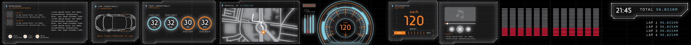

# Console 🚘

A lightweight, fully open-source dashboard app for the Honda Prelude Gen4, designed in Rust using `egui` and `eframe`. Modular plugin architecture for rendering vehicle data such as OBD1 or ESP32 sensors.



## 🎯 Features

- Draggable, dynamic plugin panels (speed, RPM, music, tire pressure, etc.)
- Modular plugin system using Rust dynamic libraries
- Real-time telemetry display
- Cross-platform: works on Windows, Linux, and soon Android
- No company or licence dependencies — pure Rust stack

## 🖥️ Tech Stack

- **Language**: Rust (safe, fast, no GC)
- **UI**: egui + eframe
- **Plugin System**: libloading + traits
- **Serial/BLE**: serialport-rs + btleplug
- **Storage**: serde_json or rusqlite
- **Android-ready**: cargo-ndk or Slint (future)

## 🔌 How to Build

```bash
git clone https://github.com/techdrivex/console
cd console
cargo add image
cargo run
```

## 🖼️ Screenshot

The project now renders a screenshot image in the UI. Make sure the image file is located at `design/ui.jpg`.

## 🛠 Plugin System

Create a dynamic `.dll` or `.so` plugin that implements the `Plugin` trait. Place in `plugins/` folder.

```rust
pub trait Plugin {
    fn init(&mut self);
    fn update(&mut self, data: &TelemetryData);
    fn render(&self, ui: &mut egui::Ui);
}
```

## 🖌️ UI Layout Editing

The UI layout is now defined in `ui_layout.xml` using a simple XML schema. You can edit this file to change the window structure, add panels, and split views. Example:

```xml
<ui>
  <window title="Main Dashboard" width="800" height="600">
    <split direction="horizontal">
      <panel title="Speedometer"/>
      <split direction="vertical">
        <panel title="Telemetry"/>
        <panel title="Music"/>
      </split>
    </split>
  </window>
  <window title="Settings" width="400" height="300">
    <panel title="Preferences"/>
  </window>
</ui>
```

- You can add, remove, or rearrange `<window>`, `<split>`, and `<panel>` elements.
- The app will parse this file at startup (and can be extended to support live reloading).
- See `src/ui.rs` for the Rust data structures and parser.

## 📜 License

MIT

---

Project by [Mehmet AKALIN](https://github.com/makalin)

Forked from: https://github.com/techdrivex/console